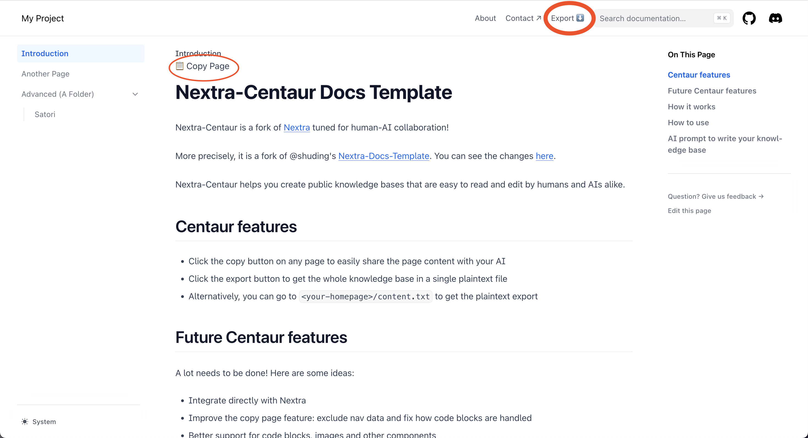

# Nextra-Centaur Docs Template 

Nextra-Centaur is a fork of [Nextra](https://nextra.site) tuned for human-AI collaboration!

More precisely, it is a fork of @shuding's [Nextra-Docs-Template](https://github.com/shuding/nextra-docs-template). You can see the changes [here](https://github.com/shuding/nextra-docs-template/compare/main...vlad-ds:nextra-centaur-docs-template:main).

Nextra-Centaur helps you create public knowledge bases that are easy to read and edit by humans and AIs alike.

## Centaur features

- Click the copy button on any page to easily share the page content with your AI
- Click the export button to get the whole knowledge base in a single plaintext file
- Alternatively, you can go to `<your-homepage>/content.txt` to get the plaintext export

## Future Centaur features
A lot needs to be done! Here are some ideas:
- Integrate directly with Nextra
- Improve the copy page feature: exclude nav data and fix how code blocks are handled
- Better support for code blocks, images and other components
- Improve the export feature: pick the order of the pages and get markdown instead of plaintext
- Add API endpoint to expose a sitemap. For each page, include a description and a count of words / tokens
- Add API endpoint to get the content of a single page
- Claude MCP and Custom GPTs integrations
- Add chatbot support into the website

Feel free to contribute!

## How it works
- The copy button is a React component that is added to every page.
- For the export feature, we run a script at build time to generate a `content.txt` file in the `public` folder. This file contains the content of all the pages, concatenated together.

## How to use

- Fork this template
    - To deploy on Vercel, click the Deploy button above.
    - Or you can select "Use this template" in GitHub, but you will have to figure out how to deploy it yourself.
- Create your knowledge base by writing markdown files in the `pages` folder. Read the [Nextra documentation](https://nextra.site/docs) for more information. See below for a prompt that will help your AI write the knowledge base.
- Deploy your knowledge base on Vercel or any other platform that supports Next.js. (If you clicked on the Vercel button above, it should be automatically deployed to Vercel.)
- Every page has a copy button that allows you to copy the page content to your clipboard. This makes it easy to share the page content with your AI!
- Once you deploy your site, go to `<your-homepage>/api/export` to get the whole knowledge base in a single plaintext file! Paste this in your AI chat or directly provide the link to your AI.

TODO: add live demo link

## AI prompt to write your knowledge base

Use this prompt to get help writing your knowledge base:

> You are going to write a knowledge base on the topic of `TOPIC`. The knowledge base will be implemented in Nextra-Centaur, an AI-friendly fork of Nextra. The knowledge base contains articles in MDX format. They are organized in nested folders. First, define the structure of the knowledge base. Then, add each article in MDX format. The articles must be added to the `pages/` folder of the repository. Each folder has a `_meta.json` file that defines the metadata for the pages in that folder. Guide the user to add the articles to the `pages/` folder and to define the metadata for each page. You can define a list of terminal commands that the user can run in the repository root. Finally, write the content of each article.

In the future, I plan to add a scaffolding that will allow the AI to write the knowledge base automatically!

## Quick Start

Click the button to clone this repository and deploy it on Vercel:

## Local Development

First, run `pnpm i` to install the dependencies.

Then, run `pnpm dev` to start the development server and visit localhost:3000.

## License

This project is licensed under the MIT License.
